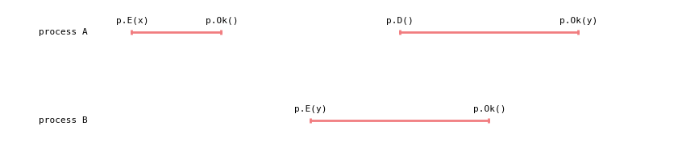
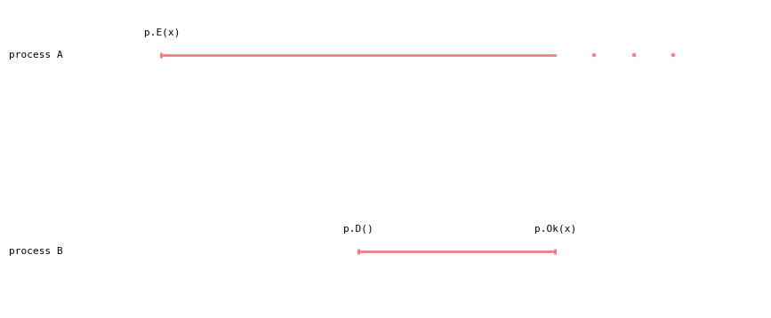
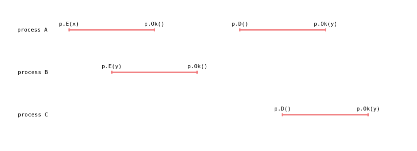
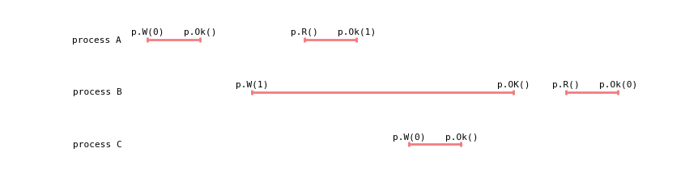

# Linearizability #
[Linearizability](http://cs.brown.edu/~mph/HerlihyW90/p463-herlihy.pdf)
visualizer.

## Queues ##
(a) `H1` (acceptable)

(b) `H2` (not acceptable)

(c) `H3` (acceptable)

(d) `H4` (not acceptable)

## Registers ##
(a) `H5` (acceptable)

(b) `H6` (not acceptable)

